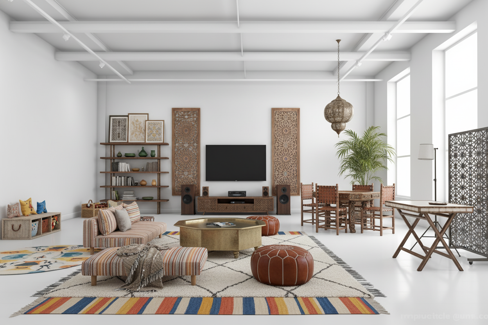

**Upload a room photo → choose a style → get a photorealistic AI makeover**

---

## 🎯 What It Does

Upload any room photo, select your design preferences, and receive a **photorealistic interior design makeover** powered by Google's `gemini-2.5-flash-image` model. Non-structural elements are redesigned while preserving the room's layout and architecture.

---

## ✨ Features

| Feature | Description |
|---|---|
| 🖼️ **Image Upload** | Drag-and-drop or file picker for room photos |
| 🛋️ **Room Type** | Living Room, Kitchen, Bedroom, and more |
| 🎨 **Design Styles** | 10 aesthetics — Modern, Scandinavian, Coastal, etc. |
| 💡 **Room Feel** | Cozy, Bright, Minimal, and other mood options |
| ✏️ **Custom Prompts** | Add specific requests ("Include a blue sofa") |
| 🔄 **Before vs After** | Side-by-side comparison view |
| 🔁 **Iterative Refinement** | Refine the result with follow-up prompts |
| 📜 **Generation History** | Auto-saved to `localStorage` |
| 📥 **Download** | Save the final high-quality generated image |

---
## 📸 Screenshots

## 🛠 Tech Stack

| Technology | Purpose |
|---|---|
| **React + TypeScript** | Frontend UI with hooks |
| **Tailwind CSS** | Styling |
| **Gemini 2.5 Flash Image** | AI room generation |
| **@google/genai SDK** | API integration |
| **importmap + Babel** | Zero-build-step browser bundling |

---

## ⚡ Quick Start

No build step required — runs directly in the browser.

1. Get a free Gemini API key at [Google AI Studio](https://aistudio.google.com/app/apikey)
2. Open `interior.html` in any modern browser
3. Paste your API key in the bar at the top
4. Upload a room photo and generate

🔗 **[Live Demo](https://vijaykrishna2334.github.io/Partial-Makeover/interior.html)**
---

## 📬 Contact

**Built by [Vijay Krishna](https://github.com/Vijaykrishna2334)**
- 📧 vijaykrishna2334@gmail.com
- 💼 [LinkedIn](https://linkedin.com/in/vijaykrishna2334)

